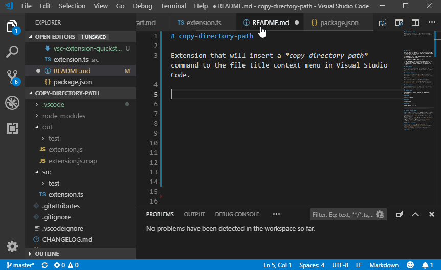

# copy-directory-path 

Extension that will insert a *copy directory path* command to the file title context menu in Visual Studio Code. 
Like *Current Dir. path to clipboard* in _Notepad++_.

## Requirements

## Extension Settings

## Known Issues
On Debian (Ubuntu) the _xclip_ package is not installed by default.

To fix, run

`sudo apt install xclip`

## Release Notes

### 1.0.1
Fix #1, support for non-windows os 

-Use node path module istead of string manipulation

### 1.0.0

Initial release of *copy-directory-path*.
